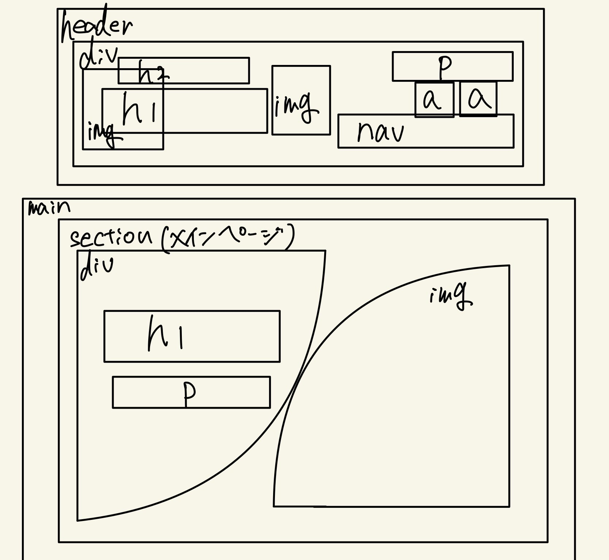
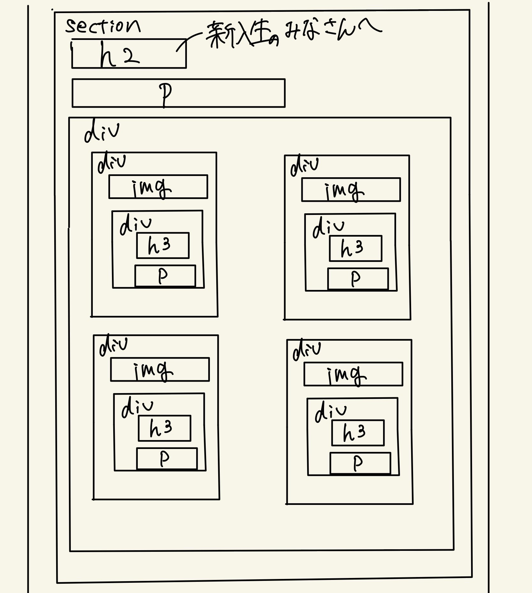
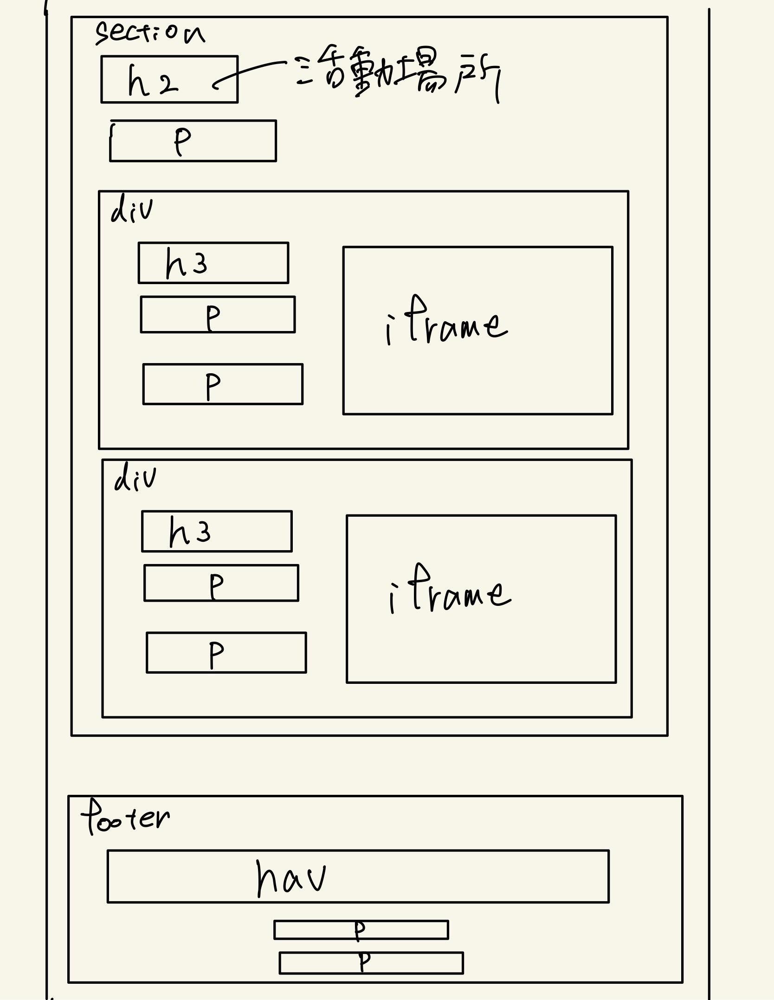

# ファイル構成

KIT  
├─top.html  &emsp;トップページ  
├─index.html  &emsp;概要ページ  
├─record.html  &emsp;記録ページ  
├─intro.html  &emsp;選手紹介ページ  
├─blog.html  &emsp;ブログページ  
├─admi.html  &emsp;管理者ページ（ブログの更新など）  
│  
├─app.php phpファイル   
│  
└─public  
 &emsp;&emsp;├─image  
 &emsp;&emsp;└─css  

# 必要なページ

* トップページ  
* 部活紹介ページ  
* 記録ページ   
* 選手紹介ページ  
* ブログページ  
* 管理者ページ  

# トップページの構成
 
  

